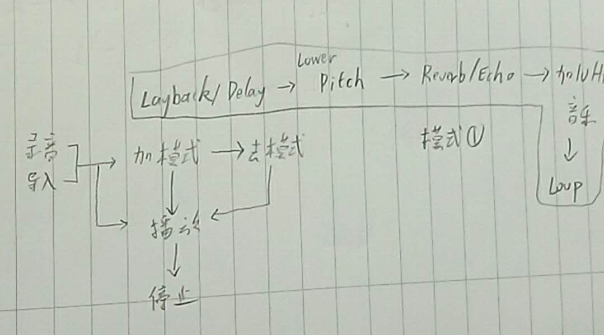

# Sound processing


### How to run: 
First `npm install`. Dev mode: `npm run dev`. To build static package: `npm run build`.





### Reference
* https://www.transparentcorp.com/products/np/tutorials/WorkingWithRecordings/index.html
* https://www.youtube.com/watch?v=zrR3reCq564

### Useful data
* [音高频率表](https://zh.wikipedia.org/wiki/%E9%9F%B3%E9%AB%98#.E9.9F.B3.E9.AB.98.E9.A0.BB.E7.8E.87.E8.A1.A8)


### Articles
* https://css-tricks.com/introduction-web-audio-api/
* https://benzleung.github.io/2017/03/15/Web-Audio-API-Guide-Advanced-User/


### hahah

* AudioBuffer.getChannelData
PCM数据：https://www.cnblogs.com/CoderTian/p/6657844.html

* 卷积ref: https://benzleung.github.io/web-audio-api-demo/convolution.html


## 代码解释
`main.js`是入口文件，由它去调用其他函数让程序开始运行。其中一开始只是让webpack引入我们需要的css assets文件，然后new App(), 生成一个App对象，App是这个sound程序主要的管理程序。

`Audio/Sound.js`, 接收AudioBuffer,生成一个AudioSource。 就是一个声音对象，后面的混响滤波均apply在声音对象上。
`Audio/MyRecorder.js`, 只是稍微包装了一下Recorder.js, 提供基础的录音功能。

`utils/helper.js` 只是一些通用功能，比如loadSound，不管什么时候你需要加载一个音频进来，可以直接调用它，会返回一个buffer.


Web Audio本身不难，你可以看一下这个教程，讲的简单易懂：https://benzleung.github.io/2017/03/15/Web-Audio-API-Guide-Getting-Started/ .

Audio api主要的就是将一个个node串联起来，逐个处理音频。Node本身会有connect方法。
基本声音处理过程就是，通过加载音频文件或者录音，得到AudioBuffer格式的数据（得到的过程不难，代码中有，一般就几行）；然后创建AudioSource，buffer传给它，它有start(), stop()之类的方法。另一种重要的node叫做gainNode, 用来控制音量。剩下的主要就是一个处理音频的node了，加滤波的，加立体声效果之类的。
加滤波示例：
```
  const destLowpassNode = this.audioCtx.createBiquadFilter();
  destLowpassNode.type = 'lowpass';
  destLowpassNode.frequency.value = 880;
  destLowpassNode.Q.value = 0.7;
  sound.setOutput(destLowpassNode);
  destLowpassNode.connect(this.audioCtx.destination);
  sound.play();
```


10Hz的那个滤波我懒得下，用了另外一个，应用过程也不难：加载wav文件，然后有一种filter node叫做convolverNode，是拿来做卷积的，计算过程我也不懂，但是它一般是拿来叠加音频特效在原始音频上，你可以自己看上面提到的教程。


做好的网页上，record那一排按钮是就是录音的，你可以点start试试。
下面那个按钮是直接加载音频，拿来试filter的。
后面你可以根据自己的需求重新安排一个button的种类，对应的事件等。还有应用filter。
Sound和MyRecorder基本不需要大改，但是App.js你需要按自己需求重新排一下逻辑。

END.


